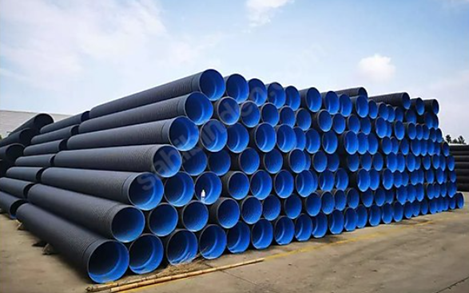

# 🏗️ Construction Site Material Counter

Count stacked **PVC pipes** on construction sites from a single photo — powered by **YOLO26 + SAHI** (Slicing Aided Hyper Inference).



## How it works

1. **Upload** a photo of a pipe stack
2. A **YOLO26** model (trained on 4,500+ annotated pipe images) scans the photo **slice by slice** with SAHI, so even small, distant pipe ends are detected
3. Get the **total count** plus an annotated image with every detected pipe marked

**Field accuracy: ~97%** on dense stacks of 130+ pipes.

## Why SAHI?

YOLO downscales the whole image before inference — distant pipe ends shrink to a few pixels and vanish. SAHI cuts the image into overlapping 512×512 tiles, runs YOLO on each tile at full detail, then merges detections with NMS. On our test image this took the count from **95 → 128** (ground truth: 132).

The app also auto-upscales small images (<1500px) to give SAHI room to slice — a trick that alone recovered 20+ missed pipes.

## Run locally

```bash
pip install -r requirements.txt
streamlit run streamlit_app.py
```

## Train your own model

The full training pipeline is in [`pipe_counter_training.ipynb`](pipe_counter_training.ipynb) —
designed for Google Colab (T4 GPU):

1. Upload the notebook to [Google Colab](https://colab.research.google.com) and select a GPU runtime
2. Get a free API key from [Roboflow](https://roboflow.com) and replace `WRITE_YOUR_ROBOFLOW_API_KEY`
3. Run the cells in order: setup → dataset download → training → SAHI counting test

The notebook includes RAM-safe training settings for free Colab, Google Drive
checkpointing (survives session drops via `resume=True`), and the crucial
`max_det=1000` fix for dense-scene counting.

## Tech stack

- [Ultralytics YOLO26](https://github.com/ultralytics/ultralytics) (nano) — trained on the [p15-pipe](https://universe.roboflow.com/constructionmaterial/p15-pipe) dataset (Roboflow Universe, CC BY 4.0)
- [SAHI](https://github.com/obss/sahi) — sliced inference for dense small-object detection
- [Streamlit](https://streamlit.io) — UI

## Roadmap

- [x] Phase 1 — PVC pipe counting
- [ ] Phase 2 — concrete culvert pipes (beton büz)
- [ ] Phase 3 — cement bags
